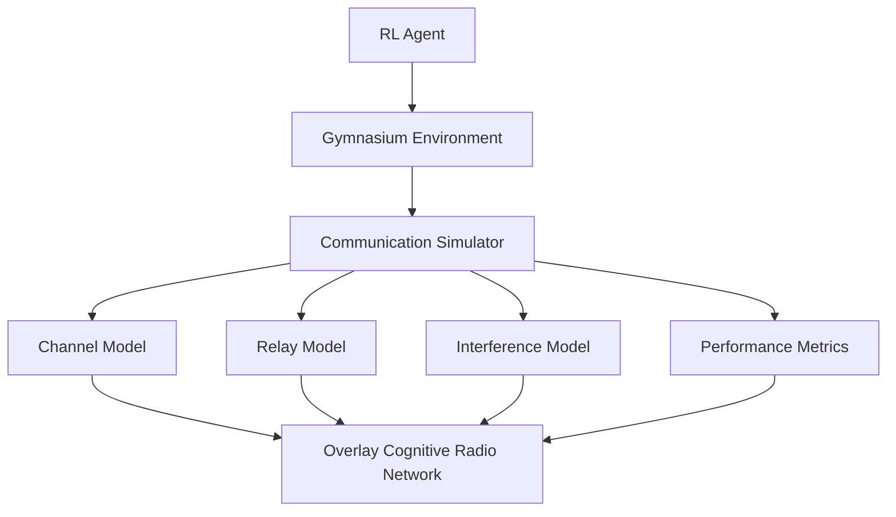
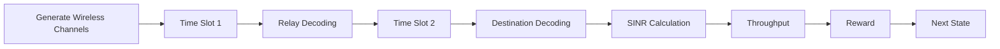
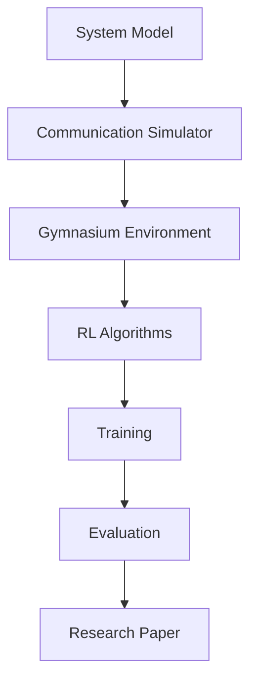

<div align="center">

# ⚡ Overlay Cognitive Radio Networks using Reinforcement Learning

### A Modular Research Framework for Intelligent Spectrum Sharing using Deep Reinforcement Learning


---

> **Building a modular reinforcement learning framework for Overlay Cognitive Radio Networks capable of supporting multiple wireless communication models and RL algorithms.**

</div>

---

# 📖 Overview

Traditional wireless spectrum allocation suffers from poor spectrum utilization due to static licensing policies. Cognitive Radio Networks (CRNs) enable intelligent spectrum sharing by allowing Secondary Users (SUs) to opportunistically utilize licensed spectrum while ensuring that Primary Users (PUs) experience minimal performance degradation.

This project implements an **Overlay Cognitive Radio Network** using **Decode-and-Forward (DF) relaying** and applies **Deep Reinforcement Learning** to optimize communication performance under realistic wireless channel conditions.

The framework is designed to be modular, allowing different communication models and reinforcement learning algorithms to be integrated with minimal code changes.

---

# 🎯 Objectives

- Build a complete Overlay Cognitive Radio Network simulator
- Implement Decode-and-Forward relay communication
- Model realistic wireless channels using Rayleigh fading
- Integrate the simulator with Gymnasium
- Train Reinforcement Learning agents using Stable Baselines3
- Compare multiple RL algorithms on identical environments
- Provide a reusable framework for future wireless communication research

---

# 🏗 System Architecture



---

# 📡 Overlay Network Topology

```
               Primary Network

        PT ------------------------> PR
         \                          /
          \                        /
           \                      /
            \                    /
             \                  /
              \                /
             SU Relay (SUR)
             /              \
            /                \
           /                  \
        SU Source ---------> SU Destination


Time Slot 1
------------
PT  → PR
SU1 → Relay

Time Slot 2
------------
PT → PR
Relay → Destination
```

---

# 🧠 Communication Flow



---

# 🧩 Tech Stack

| Category | Technology |
|-----------|------------|
| Language | Python 3.11+ |
| Deep Learning | PyTorch |
| RL Framework | Gymnasium |
| RL Algorithms | Stable Baselines3 |
| Numerical Computing | NumPy |
| Scientific Computing | SciPy |
| Data Analysis | Pandas |
| Visualization | Matplotlib |
| Configurations | PyYAML |
| Experiment Tracking | TensorBoard |
| Testing | pytest |
| Code Formatting | black |
| Linting | ruff |

---

# 📂 Repository Structure

```
CRN-RL-Framework/

│
├── configs/
│   ├── config.yaml
│   └── experiment.yaml
│
├── docs/
│   ├── architecture.md
│   ├── system_model.md
│   ├── equations.md
│   └── roadmap.md
│
├── simulator/
│   ├── base_model.py
│   ├── overlay_model.py
│   ├── channels.py
│   ├── propagation.py
│   ├── relay.py
│   ├── interference.py
│   ├── metrics.py
│   └── utils.py
│
├── envs/
│   └── crn_env.py
│
├── agents/
│   ├── train_dqn.py
│   ├── train_ddqn.py
│   ├── train_ppo.py
│   └── evaluate.py
│
├── baselines/
│   ├── random_policy.py
│   ├── fixed_power.py
│   └── greedy.py
│
├── experiments/
│
├── plots/
│
├── notebooks/
│
├── tests/
│
├── requirements.txt
│
├── main.py
│
└── README.md
```

---

# 📁 Module Responsibilities

## 📡 simulator/

Contains the complete communication system implementation.

| File | Description |
|------|-------------|
| base_model.py | Base simulator interface |
| overlay_model.py | Complete Overlay CRN implementation |
| channels.py | Rayleigh channel generation |
| propagation.py | Path loss & distance models |
| relay.py | Decode-and-Forward relay logic |
| interference.py | Interference calculations |
| metrics.py | SINR, Throughput & Capacity |
| utils.py | Common helper utilities |

---

## 🌍 envs/

Implements the Gymnasium interface.

Responsible for:

- Observation Space
- Action Space
- Reward Function
- Environment Reset
- Step Function

---

## 🤖 agents/

Contains all Reinforcement Learning training scripts.

Current algorithms:

- DQN
- Double DQN
- PPO

Future algorithms:

- SAC
- TD3
- A2C
- Rainbow DQN

---

## 📊 experiments/

Stores

- Training Logs
- Evaluation Results
- Model Checkpoints
- Hyperparameters

---

## 📈 plots/

Automatically generated graphs.

Examples

- Episode Reward
- Throughput
- SINR
- Spectral Efficiency
- Convergence Curves

---

# 🔄 Development Workflow



---

# 🚀 Getting Started

Clone the repository

```bash
git clone https://github.com/your-repository/CRN-RL-Framework.git

cd CRN-RL-Framework
```

Install dependencies

```bash
pip install -r requirements.txt
```

Run the simulator

```bash
python main.py
```

Train a DQN Agent

```bash
python agents/train_dqn.py
```

Train a PPO Agent

```bash
python agents/train_ppo.py
```

---

# 📅 Roadmap

- [x] Repository Setup
- [x] Project Architecture
- [ ] Mathematical System Model
- [ ] Communication Simulator
- [ ] Gymnasium Environment
- [ ] DQN Implementation
- [ ] PPO Implementation
- [ ] Performance Evaluation
- [ ] Hyperparameter Optimization
- [ ] Research Paper Draft
- [ ] IEEE Conference Submission

---

# 👨‍💻 Team

| Member | Responsibilities |
|---------|------------------|
| Ryan | Project Lead, System Model, Repository Architecture, Gymnasium Integration, Final Integration |
| Sneha | Wireless Channel Models, Rayleigh Fading, Path Loss, Noise Model |
| Shreya | Relay Protocol, SINR, Time Slot Logic, Interference Model |
| Aditya | RL Algorithms, Stable Baselines3 Integration, Training & Evaluation |

---

# 🔬 Future Extensions

The framework is designed to support:

- Underlay Cognitive Radio Networks
- Overlay Cognitive Radio Networks
- Interweave Cognitive Radio Networks
- RIS-assisted Networks
- UAV-assisted Networks
- Multi-Relay Networks
- Multi-Agent Reinforcement Learning
- Federated Reinforcement Learning

without requiring major architectural changes.

---

# 🤝 Contributing

Contributions are welcome!

Please create a feature branch before submitting a Pull Request.

```bash
git checkout -b feature/new-feature
```

Follow the project's coding standards and include tests where applicable.

---

# 📜 License

This project is intended for academic and research purposes.

---

<div align="center">

### ⭐ If you find this project useful, consider giving it a star!

**Built with ❤️ for Wireless Communications, Cognitive Radio Networks and Reinforcement Learning Research**

</div>
