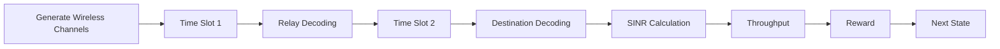
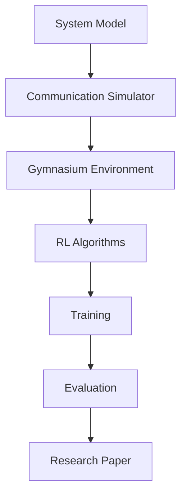

<div align="center">

# ⚡ Overlay Cognitive Radio Networks using Reinforcement Learning

### A Modular Research Framework for Intelligent Spectrum Sharing using Deep Reinforcement Learning


---

> **Building a modular reinforcement learning framework for Overlay Cognitive Radio Networks capable of supporting multiple wireless communication models and RL algorithms.**

</div>

---

# 📖 Overview

Traditional wireless spectrum allocation suffers from poor spectrum utilization due to static licensing policies. Cognitive Radio Networks (CRNs) enable intelligent spectrum sharing by allowing Secondary Users (SUs) to opportunistically utilize licensed spectrum while ensuring that Primary Users (PUs) experience minimal performance degradation.

This project implements an **Overlay Cognitive Radio Network** using **Decode-and-Forward (DF) relaying** and applies **Deep Reinforcement Learning** to optimize communication performance under realistic wireless channel conditions.

The framework is designed to be modular, allowing different communication models and reinforcement learning algorithms to be integrated with minimal code changes.

---

# 🎯 Objectives

- Build a complete Overlay Cognitive Radio Network simulator
- Implement Decode-and-Forward relay communication
- Model realistic wireless channels using Rayleigh fading
- Integrate the simulator with Gymnasium
- Train Reinforcement Learning agents using Stable Baselines3 and custom Pytorch implementations
- Compare multiple RL algorithms on identical environments
- Provide a reusable framework for future wireless communication research

---

# 🏗 System Architecture

The repository supports multiple Reinforcement Learning agents running on a shared wireless simulation infrastructure.


### Shared Infrastructure Overview
*   **Environment**: A Gymnasium-compatible wrapper (`envs/crn_env.py`) managing states and coordinate matrices.
*   **Replay Buffers**: Flat transitions buffer (used by T3) and episodic sequential buffer (used by Underlay/Overlay TD3).
*   **Neural Networks**: Base actor and critic layouts, recurrent GRU encoders, and twin value prediction heads.
*   **Logging & Config**: Consolidated YAML configurations and unified TensorBoard summaries.

---

# 🤖 Supported Algorithms

The repository supports three distinct reinforcement learning agents:

### 1. T3 (Twin Delayed DDPG Baseline)
A standard baseline implementation for comparison:
*   **Twin Critics**: Mitigates target value overestimation bias by tracking the minimum of two value estimators.
*   **Delayed Policy Updates**: Updates the actor network less frequently than the critics to ensure target stability.
*   **Target Policy Smoothing**: Adds target noise to actions to reduce Q-value function variance.

### 2. Underlay TD3 (Original CAMO-TD3 adaptation)
Fulfills the original CAMO-TD3 design methodology:
*   **GRU Belief Encoder**: Processes historical sequences of length $L=10$ observations and actions to tackle partial observability.
*   **Sequence Replay Buffer**: Episode-aware sampling ensuring clean boundary tracking.
*   **Lagrangian Constrained Optimization**: Learns softplus-parameterized multipliers $\lambda_{inf}$ and $\lambda_{nrg}$ to restrict interference power and energy.
*   **Directional Safety Exploration**: Actively pushes exploration paths away from constraint boundaries.

### 3. Overlay TD3 (Overlay Cooperative Custom Redesign)
A novel custom architecture specifically redesigned for Overlay CRNs:
*   **Relay & QoS-Aware Belief State**: Encoder input sequence expands to 8D by integrating previous slot relay decoding success ($D_{relay}$) and PU outage event ($O_{pu}$) history.
*   **Direct Quality of Service Constraint**: Enforces PU rate $R_p \ge R_{threshold}$ directly using a dedicated QoS Critic pair, ensuring cooperative compliance.
*   **Dual Lagrangian Optimization**: Learnable constraints for PU rate ($R_{threshold} - Q^{QoS} \le 0$) and SU power ($Q^{nrg} - E_{limit} \le 0$).
*   **Cooperative Safety Exploration**: Exploration gradient biases power allocations to maximize PU rate while minimizing SU energy:
    $$v_t = \lambda_{QoS} \cdot \nabla_a Q^{QoS}_1(b_t, a) - \lambda_{nrg} \cdot \nabla_a Q^{nrg}_1(b_t, a)$$

---

# 🚀 Project Features

*   **Standard T3 Baseline**: Benchmarking benchmark for deterministic policy gradient agents.
*   **Underlay TD3 Agent**: Recreates the original CAMO-TD3 algorithm under standard constraints.
*   **Overlay TD3 Agent**: Novel research-grade extension optimized for cooperative Decode-and-Forward networks.
*   **Sequence Replay Buffer**: Supports flat transition indexing and sequential sampling.
*   **GRU Belief Encoder**: Addresses Rayleigh fading partial observability.
*   **Multi-objective Critics**: Independent value estimation for rates, violations, and energy.
*   **Adaptive Lagrangian Optimizers**: Automatically updates constraint penalty coefficients.
*   **Directional Exploration Bias**: Restricts constraint violations during exploratory steps.
*   **Comparative Benchmarking**: Scripted tool to train, compare, and plot performances.
*   **Unified Evaluation & Checkpoints**: Uniform save, load, and test pipelines.

---

# 📡 Overlay Network Topology

```
               Primary Network

        PT ------------------------> PR
         \                          /
          \                        /
            \                    /
             \                  /
              \                /
             SU Relay (SUR)
             /              \
            /                \
           /                  \
        SU Source ---------> SU Destination


Time Slot 1
------------
PT  → PR
SU1 → Relay

Time Slot 2
------------
PT → PR
Relay → Destination
```

---

# 🧠 Communication Flow



---

# 🧩 Tech Stack

| Category | Technology |
|-----------|------------|
| Language | Python 3.11+ |
| Deep Learning | PyTorch |
| RL Framework | Gymnasium |
| Numerical Computing | NumPy |
| Scientific Computing | SciPy |
| Data Analysis | Pandas |
| Visualization | Matplotlib |
| Configurations | PyYAML |
| Experiment Tracking | TensorBoard |
| Testing | pytest |
| Code Formatting | black |
| Linting | ruff |

---

# 📂 Repository Structure

```
CRN-RL-Framework/
│
├── configs/
│   ├── config.yaml
│   └── experiment.yaml
│
├── docs/
│   ├── architecture.md
│   ├── system_model.md
│   ├── equations.md
│   └── roadmap.md
│
├── simulator/
│   ├── base_model.py
│   ├── overlay_model.py
│   ├── channels.py
│   ├── propagation.py
│   ├── relay.py
│   ├── interference.py
│   ├── metrics.py
│   └── utils.py
│
├── envs/
│   └── crn_env.py
│
├── agents/
│   ├── models.py          # GRU Encoder, Actor, and Twin Critics
│   ├── buffers.py         # Sequence Replay Buffers (flat/episodic/overlay)
│   ├── train_td3.py       # Training logic for T3, Underlay TD3, Overlay TD3
│   ├── evaluate.py        # Standalone evaluation & checkpoint loader
│   └── benchmark.py       # Comparative benchmarking automation
│
├── baselines/
│   ├── random_policy.py
│   ├── fixed_power.py
│   └── greedy.py
│
├── experiments/
│   └── checkpoints/       # Saved models (best and final)
│
├── plots/                 # Saved performance charts
│
├── tests/
│   └── test_camo.py       # Unit verification test suite
│
├── requirements.txt
│
├── main.py                # Pipeline orchestrator
│
└── README.md
```

---

# 📁 Module Responsibilities

## 📡 simulator/

Contains the complete communication system implementation.

| File | Description |
|------|-------------|
| base_model.py | Base simulator interface |
| overlay_model.py | Complete Overlay CRN implementation |
| channels.py | Rayleigh channel generation |
| propagation.py | Path loss & distance models |
| relay.py | Decode-and-Forward relay logic |
| interference.py | Interference calculations |
| metrics.py | SINR, Throughput, Capacity & BER |
| utils.py | Common helper utilities |

---

## 🌍 envs/

Implements the Gymnasium interface.

Responsible for:
- Observation Space
- Action Space
- Reward Function
- Environment Reset
- Step Function & History Tracking

---

## 🤖 agents/

Contains RL network models, training files, and comparative tools.

Algorithms implemented:
- **T3**
- **Underlay TD3**
- **Overlay TD3**

---

# 🔄 Development Workflow



---

# 🚀 Getting Started

Clone the repository:
```bash
git clone https://github.com/your-repository/CRN-RL-Framework.git
cd CRN-RL-Framework
```

Install dependencies:
```bash
pip install -r requirements.txt
```

### Running Training
Select your algorithm in `configs/config.yaml`:
```yaml
algorithm:
  name: OVERLAY_TD3  # Options: T3, UNDERLAY_TD3, OVERLAY_TD3
```

Execute training using the entry point:
```bash
python main.py
```

### Running Standalone Evaluation
Evaluate the selected algorithm policy using saved checkpoints:
```bash
python agents/evaluate.py
```

---

# 📊 Comparative Benchmarking

The repository includes a dedicated benchmark script that trains all three agents sequentially and compares wireless performance metrics (Throughput, BER, Outage, Convergence) and computational efficiency (Training time, Inference time):

```bash
python agents/benchmark.py
```

The script prints a markdown summary table and writes comparison graphs inside the `plots/` directory:
*   `plots/throughput_comparison.png`
*   `plots/ber_comparison.png`
*   `plots/outage_comparison.png`
*   `plots/convergence_comparison.png`
*   `plots/lambda_comparison.png`
*   `plots/time_comparison.png`

---

# 🔬 Research Contributions

*   **T3 Implementation**: Standard twin-critic policy gradient baseline.
*   **Underlay TD3 Agent**: Adaption of original CAMO-TD3 constraints formulation.
*   **Overlay TD3 Model**: Novel custom extension addressing partial observability and strict cooperative license constraints.
*   **Unified Benchmarking Framework**: Direct comparative environment comparing RL agents on identical scenarios.

---

# 📑 Documentation

For additional design details, audit structures, and reports:
*   [OVERLAY_CAMO_DESIGN.md](file:///d:/Mini%20Project/crn_overlay-/OVERLAY_CAMO_DESIGN.md) — Mathematical redesign derivations.
*   [PHASE1_IMPLEMENTATION_REPORT.md](file:///d:/Mini%20Project/crn_overlay-/PHASE1_IMPLEMENTATION_REPORT.md) — Adaption of CAMO-TD3.
*   [PHASE2_IMPLEMENTATION_REPORT.md](file:///d:/Mini%20Project/crn_overlay-/PHASE2_IMPLEMENTATION_REPORT.md) — Implementation details of Overlay TD3.
*   [IMPLEMENTATION_AUDIT_REPORT.md](file:///d:/Mini%20Project/crn_overlay-/IMPLEMENTATION_AUDIT_REPORT.md) — Repository structural and mathematical audit.
*   [FINAL_CHECKLIST.md](file:///d:/Mini%20Project/crn_overlay-/FINAL_CHECKLIST.md) — Verification checklist matrix.

---

# 📅 Roadmap

- [x] Repository Setup
- [x] Project Architecture
- [x] Mathematical System Model
- [x] Communication Simulator
- [x] Gymnasium Environment
- [x] T3 Baseline Implementation
- [x] Underlay TD3 Implementation
- [x] Overlay TD3 Design & Implementation
- [x] Performance Evaluation & Comparative Benchmarks
- [ ] Hyperparameter Optimization
- [ ] Research Paper Draft
- [ ] IEEE Conference Submission

---

# 👨‍💻 Team

| Member | Responsibilities |
|---------|------------------|
| Ryan | System Model, Repository Architecture, Gymnasium Integration, Final Integration |
| Sneha | Wireless Channel Models, Rayleigh Fading, Path Loss, Noise Model |
| Shreya | Relay Protocol, SINR, Time Slot Logic, Interference Model |
| Aditya | RL Algorithms, T3/Underlay/Overlay Agents, Training & Evaluation |

---

# 🤝 Contributing

Contributions are welcome! Please create a feature branch before submitting a Pull Request:
```bash
git checkout -b feature/new-feature
```

---

# 📜 License

This project is intended for academic and research purposes.

---

<div align="center">

### ⭐ If you find this project useful, consider giving it a star!

**Built with ❤️ for Wireless Communications, Cognitive Radio Networks and Reinforcement Learning Research**

</div>
