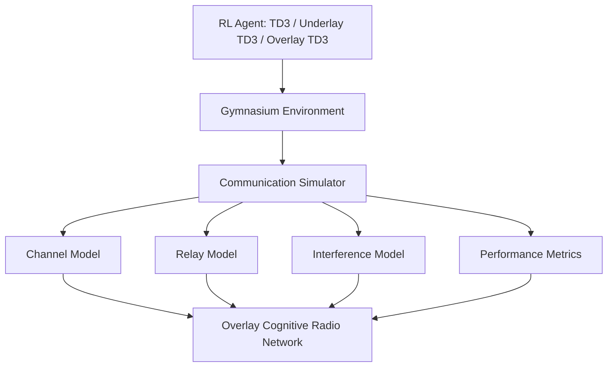
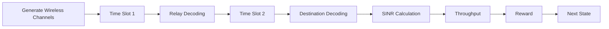
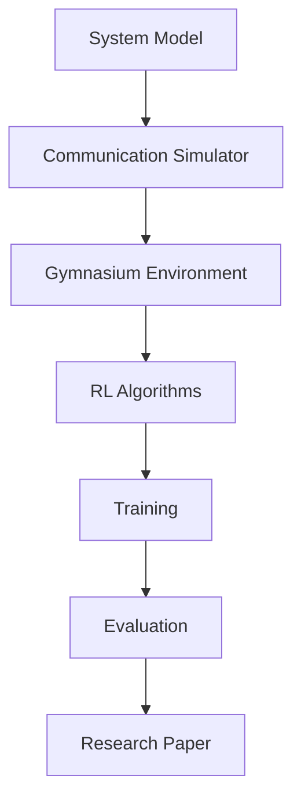
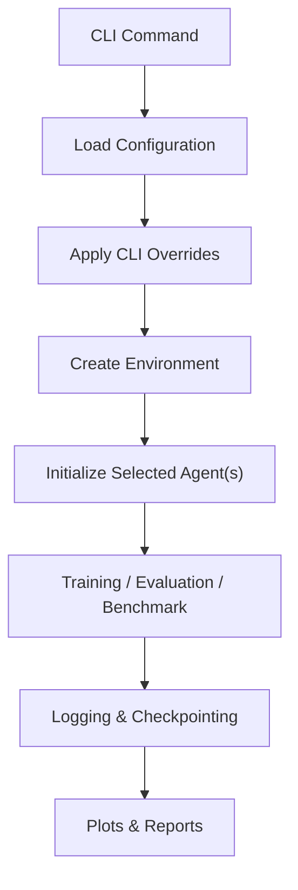

<div align="center">

# ⚡ Overlay Cognitive Radio Networks using Reinforcement Learning

### A Modular Research Framework for Intelligent Spectrum Sharing using Deep Reinforcement Learning


---

> **Building a modular reinforcement learning framework for Overlay Cognitive Radio Networks capable of supporting multiple wireless communication models and RL algorithms.**

</div>

---

# 📖 Overview

Traditional wireless spectrum allocation suffers from poor spectrum utilization due to static licensing policies. Cognitive Radio Networks (CRNs) enable intelligent spectrum sharing by allowing Secondary Users (SUs) to opportunistically utilize licensed spectrum while ensuring that Primary Users (PUs) experience minimal performance degradation.

This repository is a **modular reinforcement learning research framework** designed to optimize communication performance under realistic wireless channel conditions using **Decode-and-Forward (DF) relaying** and **Deep Reinforcement Learning** constraints. The framework is designed to be highly modular and supports:
*   **Overlay Cognitive Radio Networks** simulation and protocols.
*   **Multiple RL Agents**: Benchmarks and comparisons across different neural network architectures.
*   **Unified Experiment Management**: Direct command-line control of training, testing, evaluations, and checkpoints.
*   **Comparative Benchmarking**: Pre-built commands to evaluate agents side-by-side.
*   **Multi-seed Reproducibility**: Predefined seeds to validate statistical significance.
*   **Automated Evaluation**: Continuous validation metrics logs.
*   **Experiment Tracking**: TensorBoard event logs and metrics snapshots automatically collected.

---

# 🎯 Objectives

- Build a complete Overlay Cognitive Radio Network simulator
- Implement Decode-and-Forward relay communication
- Model realistic wireless channels using Rayleigh fading
- Integrate the simulator with Gymnasium
- Train Reinforcement Learning agents using Stable Baselines3 and custom Pytorch implementations
- Compare multiple RL algorithms on identical environments
- Provide a reusable framework for future wireless communication research

---

# 🏗 System Architecture

The repository supports multiple Reinforcement Learning agents running on a shared wireless simulation infrastructure.



### Shared Infrastructure Overview
*   **Environment**: A Gymnasium-compatible wrapper (`envs/crn_env.py`) managing states and coordinate matrices.
*   **Replay Buffers**: Flat transitions buffer (used by TD3) and episodic sequential buffer (used by Underlay/Overlay TD3).
*   **Neural Networks**: Base actor and critic layouts, recurrent GRU encoders, and twin value prediction heads.
*   **Logging & Config**: Consolidated YAML configurations and unified TensorBoard summaries.

---

# 🤖 Supported Algorithms

The repository supports three distinct reinforcement learning agents:

### 1. TD3 (Twin Delayed DDPG Baseline)
A standard baseline implementation for comparison:
*   **Twin Critics**: Mitigates target value overestimation bias by tracking the minimum of two value estimators.
*   **Delayed Policy Updates**: Updates the actor network less frequently than the critics to ensure target stability.
*   **Target Policy Smoothing**: Adds target noise to actions to reduce Q-value function variance.

### 2. Underlay TD3 (Original Underlay TD3 adaptation)
Fulfills the original Underlay TD3 design methodology:
*   **GRU Belief Encoder**: Processes historical sequences of length $L=10$ observations and actions to tackle partial observability.
*   **Sequence Replay Buffer**: Episode-aware sampling ensuring clean boundary tracking.
*   **Lagrangian Constrained Optimization**: Learns softplus-parameterized multipliers $\lambda_{inf}$ and $\lambda_{nrg}$ to restrict interference power and energy.
*   **Directional Safety Exploration**: Actively pushes exploration paths away from constraint boundaries.

### 3. Overlay TD3 (Overlay Cooperative Custom Redesign)
A novel custom architecture specifically redesigned for Overlay CRNs:
*   **Relay & QoS-Aware Belief State**: Encoder input sequence expands to 8D by integrating previous slot relay decoding success ($D_{relay}$) and PU outage event ($O_{pu}$) history.
*   **Direct Quality of Service Constraint**: Enforces PU rate $R_p \ge R_{threshold}$ directly using a dedicated QoS Critic pair, ensuring cooperative compliance.
*   **Dual Lagrangian Optimization**: Learnable constraints for PU rate ($R_{threshold} - Q^{QoS} \le 0$) and SU power ($Q^{nrg} - E_{limit} \le 0$).
*   **Cooperative Safety Exploration**: Exploration gradient biases power allocations to maximize PU rate while minimizing SU energy:
    $$v_t = \lambda_{QoS} \cdot \nabla_a Q^{QoS}_1(b_t, a) - \lambda_{nrg} \cdot \nabla_a Q^{nrg}_1(b_t, a)$$

### 4. MATD3 (Multi-Agent NOMA TD3)
A multi-agent architecture designed for NOMA CRNs where multiple Secondary Users share the same relay:
*   **Decentralized GRU Actors**: Each Secondary User processes its local observation history using a GRU to form a Belief State.
*   **Centralized Relay**: A Coordination Agent concatenates belief states from all SUs to make a centralized relay decision.
*   **Centralized Critics (CTDE)**: Training utilizes a centralized information vector feeding into three dedicated critics ($Q_{Throughput}$, $Q_{QoS}$, and $Q_{Energy}$) to coordinate the global policy.

### 5. CENT_NOMA_TD3 (Centralized Flat NOMA TD3)
A fully centralized variant of NOMA TD3 for comparison purposes:
*   **Global Observation**: Assumes perfect sharing of instantaneous CSI and observations across all SUs.
*   **Single Joint Policy**: Evaluates and outputs all SU and relay actions from a single centralized policy network.

---

# 🚀 Project Features

*   **Standard TD3**: Benchmark for deterministic policy gradient agents.
*   **Underlay TD3 Agent**: Recreates the original Underlay TD3 algorithm under standard constraints.
*   **Overlay TD3 Agent**: Novel research-grade extension optimized for cooperative Decode-and-Forward networks.
*   **MATD3 Agent**: Advanced NOMA multi-agent coordination with CTDE.
*   **Centralized NOMA TD3 Agent**: Baseline for fully centralized multi-user environments.
*   **Sequence Replay Buffer**: Supports flat transition indexing and sequential sampling.
*   **GRU Belief Encoder**: Addresses Rayleigh fading partial observability.
*   **Multi-objective Critics**: Independent value estimation for rates, violations, and energy.
*   **Adaptive Lagrangian Optimizers**: Automatically updates constraint penalty coefficients.
*   **Directional Exploration Bias**: Restricts constraint violations during exploratory steps.
*   **Unified Experiment Management CLI**: Command-line control over all subcommands without editing configuration files.
*   **Multi-agent Training & Benchmarking**: Train and compare multiple algorithms sequentially under identical experimental conditions.
*   **Multi-seed Evaluation**: Predefined seeds to enforce reproducible, statistically sound evaluations.
*   **Automatic Checkpointing**: Saves best-performing models and final execution states dynamically.
*   **Automatic Report & Plot Generation**: Generates comparison plots and markdown/PDF research reports on benchmark runs.
*   **Configuration Override from CLI**: Temporarily override YAML configuration values during launching.
*   **Experiment Logging & TensorBoard Integration**: Comprehensive logging to text files and real-time training progress visualization on TensorBoard.
*   **Resume Training**: Recover interrupted executions restoring optimizer states, networks, and replay buffers.
*   **Comparative Evaluation Pipeline**: Deterministic multi-episode evaluation of model checkpoints.

---

# 📡 Overlay Network Topology

```
               Primary Network

        PT ------------------------> PR
         \                          /
          \                        /
            \                    /
             \                  /
              \                /
             SU Relay (SUR)
             /              \
            /                \
           /                  \
        SU Source ---------> SU Destination


Time Slot 1
------------
PT  → PR
SU1 → Relay

Time Slot 2
------------
PT → PR
Relay → Destination
```

---

# 🧠 Communication Flow



---

# 🧩 Tech Stack

| Category | Technology |
|-----------|------------|
| Language | Python 3.11+ |
| Deep Learning | PyTorch |
| RL Framework | Gymnasium |
| Numerical Computing | NumPy |
| Scientific Computing | SciPy |
| Data Analysis | Pandas |
| Visualization | Matplotlib |
| Configurations | PyYAML |
| Experiment Tracking | TensorBoard |
| Testing | pytest |
| Code Formatting | black |
| Linting | ruff |

---

# 📂 Repository Structure

```
CRN-RL-Framework/
│
├── configs/
│   ├── config.yaml
│   └── experiment.yaml
│
├── docs/
│   ├── architecture.md
│   ├── system_model.md
│   ├── equations.md
│   └── roadmap.md
│
├── simulator/
│   ├── base_model.py
│   ├── overlay_model.py
│   ├── channels.py
│   ├── propagation.py
│   ├── relay.py
│   ├── interference.py
│   ├── metrics.py
│   └── utils.py
│
├── envs/
│   └── crn_env.py
│
├── agents/
│   ├── models.py          # GRU Encoder, Actor, and Twin Critics
│   ├── matd3_networks.py  # Centralized critics and decentralized actors for MATD3
│   ├── buffers.py         # Sequence Replay Buffers (flat/episodic/overlay)
│   ├── ma_buffers.py      # Multi-agent replay buffers
│   ├── train_td3.py       # Training logic for TD3, Underlay TD3, Overlay TD3
│   ├── matd3.py           # Training logic and architecture for MATD3
│   ├── cent_noma_td3.py   # Training logic for Centralized Flat NOMA TD3
│   ├── evaluate.py        # Standalone evaluation & checkpoint loader
│   └── benchmark.py       # Comparative benchmarking automation
│
├── baselines/
│   ├── random_policy.py
│   ├── fixed_power.py
│   └── greedy.py
│
├── experiments/
│   └── checkpoints/       # Saved models (best and final)
│
├── plots/                 # Saved performance charts
│
├── tests/
│   └── test_camo.py       # Unit verification test suite
│
├── requirements.txt
│
├── main.py                # Pipeline orchestrator
│
└── README.md
```

---

# 📁 Module Responsibilities

## 📡 simulator/

Contains the complete communication system implementation.

| File | Description |
|------|-------------|
| base_model.py | Base simulator interface |
| overlay_model.py | Complete Overlay CRN implementation |
| channels.py | Rayleigh channel generation |
| propagation.py | Path loss & distance models |
| relay.py | Decode-and-Forward relay logic |
| interference.py | Interference calculations |
| metrics.py | SINR, Throughput, Capacity & BER |
| utils.py | Common helper utilities |

---

## 🌍 envs/

Implements the Gymnasium interface.

Responsible for:
- Observation Space
- Action Space
- Reward Function
- Environment Reset
- Step Function & History Tracking

---

## 🤖 agents/

Contains RL network models, training files, and comparative tools.

Algorithms implemented:
- **TD3**
- **Underlay TD3**
- **Overlay TD3**
- **MATD3**
- **Centralized NOMA TD3**

---

# 🔄 Development Workflow



---

# ⚙️ Experiment Management

The framework eliminates the need to manually edit configuration files every time a different experiment needs to be run. Instead, it provides a powerful, flexible command-line interface (CLI) to configure, execute, benchmark, and analyze reinforcement learning models directly from the terminal.

The YAML configuration (`configs/config.yaml`) remains the default source of truth containing baseline hyperparameters. Any arguments provided on the command line temporarily override the YAML defaults for the current execution only. The configuration file is never modified automatically, ensuring your baseline configurations remain clean.

### Experiment Execution Workflow



### CLI Subcommands Overview

| Command | Purpose |
| :--- | :--- |
| `train` | Train one or more agents sequentially |
| `evaluate` | Evaluate trained models deterministically |
| `benchmark` | Compare multiple algorithms under identical conditions |
| `compare` | Generate comparison tables from experiment outputs |
| `resume` | Resume interrupted training from the latest checkpoint |
| `plots` | Generate plots and charts from experiment logs |
| `report` | Generate experiment markdown and PDF reports |
| `checkpoints` | List and inspect stored model checkpoints |
| `config` | Display active environment and training configurations |
| `test` | Run validation tests (unit, config, smoke) |

---

# 🚀 Quick Start

Use these quick examples to get started with the framework's primary commands:

```bash
# 1. Train individual agents
python main.py train --agent td3
python main.py train --agent underlay
python main.py train --agent overlay

# 2. Benchmark all algorithms
python main.py benchmark

# 3. Resume training from the latest checkpoint
python main.py resume --agent overlay

# 4. Evaluate a checkpoint
python main.py evaluate --agent overlay

# 5. Run training for all three predefined research seeds
python main.py train --agent overlay --all-seeds
```

---

# 🏋️ Training Guidelines

The `train` subcommand allows you to train individual agents or sequences of agents under identical environment conditions.

### Train Individual Agents
```bash
python main.py train --agent td3
python main.py train --agent underlay
python main.py train --agent overlay
```

### Train Multiple Agents
To run multiple agents sequentially:
```bash
python main.py train --agents td3 underlay
python main.py train --agents td3 overlay
python main.py train --agents underlay overlay
python main.py train --agents td3 underlay overlay
```
*Note: Agents are trained sequentially under identical experimental conditions (e.g. channel fading layouts, coordinate grids) to ensure a fair and scientifically sound comparison.*

---

# 📊 Benchmarking & Evaluation

### Multi-Agent Benchmarks
Benchmark runs training across the selected algorithms and automatically outputs evaluation comparisons:
```bash
# Run default benchmark (TD3 -> Underlay TD3 -> Overlay TD3)
python main.py benchmark

# Run benchmark for a subset of algorithms
python main.py benchmark --agents td3 overlay
python main.py benchmark --agents underlay overlay
python main.py benchmark --agents td3 underlay
```

### Deterministic Policy Evaluation
Evaluate a trained model's performance over a set number of episodes:
```bash
python main.py evaluate --agent td3
python main.py evaluate --agent underlay
python main.py evaluate --agent overlay
```

### Resuming Interrupted Runs
Resume training an agent starting from its latest checkpoint:
```bash
python main.py resume --agent overlay
```
This automatically restores:
* **Model weights** for actor, critic, and target networks.
* **Optimizer states** for all active networks.
* **Lagrangian multipliers** ($\alpha$ log multipliers) and lambda optimizers where supported.
* **Training progress** (total iterations and current episode).
* **Replay buffer transitions** and sequence metadata.

---

# 🔬 Research Reproducibility & Seeds

Reproducibility is critical for wireless reinforcement learning research. The framework enforces this through:
1. **Fixed Predefined Seeds**: Enforces identical randomness allocations using the seeds:
   * `42`
   * `123`
   * `2026`
2. **Deterministic Execution**: Evaluation steps use deterministic policy actions (no exploration noise).
3. **Identical Environments**: Comparative runs share identical path loss, coordinate matrices, and channel noise layouts.

### Predefined Seed Examples
```bash
python main.py train --agent overlay --seed 42
python main.py benchmark --seed 123
```

### Evaluating All Seeds
To run the same experiment across all three predefined seeds sequentially:
```bash
python main.py benchmark --all-seeds
python main.py train --agent overlay --all-seeds
```
Using `--all-seeds` automatically executes experiments using all three seeds and reports:
* **Mean Return**
* **Standard Deviation (Std)**
* **Best Performance**
* **Worst Performance**

---

# 🎛 Command-Line Overrides & Validation

Every key environment and training parameter can be temporarily overridden from the command line:
```bash
# Train Overlay TD3 with 5000 episodes and 2000 environment steps
python main.py train --agent overlay --episodes 5000 --steps 2000 --seed 42

# Train TD3 with custom batch size on GPU
python main.py train --agent td3 --batch-size 512 --device cuda
```

### Episode & Step Constraints
To ensure consistent research metrics and prevent excessive memory allocation, the CLI enforces the following constraints:
* **Training Episodes**:
  * Default: `2000` episodes
  * Minimum limit: `500` episodes
  * Maximum limit: `5000` episodes
* **Environment Steps per Episode**:
  * Default: `500` steps
  * Minimum limit: `200` steps
  * Maximum limit: `2000` steps

---

# 📂 Experiment Outputs & Directory Structure

All run files, models, and charts are stored inside the configured output directory (default: `experiments/`):

```text
experiments/
├── td3/             # Outputs for TD3 runs
├── underlay_td3/    # Outputs for Underlay TD3 runs
├── overlay_td3/     # Outputs for Overlay TD3 runs
├── checkpoints/     # Centralized folder for latest agent model checkpoints
├── tensorboard/     # Summarized TensorBoard event logs
├── logs/            # Plain-text execution run logs
├── plots/           # Generated performance charts & comparison figures
├── reports/         # Exported markdown and PDF summaries
└── benchmarks/      # Consolidated benchmark metrics
```

### Directory Purposes
* **Algorithm-specific folders (`td3/`, etc.)**: Store individual run parameters, checkpoints, config snapshots, and local metrics.
* **`checkpoints/`**: Houses model state dictionaries (`latest.pth`) and serialized replay buffers (`latest_replay.pkl`) to support training resumption.
* **`plots/`**: Stores figures generated by report compiling (e.g. throughput comparison, outage, and convergence).
* **`reports/`**: Holds generated markdown (`research_report.md`) and PDF documents compiling returns and computational efficiency.

Every experiment run automatically archives:
1. **Configuration snapshot** (`config_snapshot.yaml`)
2. **Text logs** (`train.log`)
3. **Model checkpoints** (`best_model.pth` and `final_model.pth`)
4. **TensorBoard logs** (`events.out.tfevents.*`)
5. **Evaluation metrics** (`metrics.json` mapping rewards, SU throughput, and PU outage)
6. **Comparison plots** and generated reports.
```

---

# 🔬 Research Contributions

*   **TD3 Implementation**: Standard twin-critic policy gradient baseline.
*   **Underlay TD3 Agent**: Adaption of original Underlay TD3 constraints formulation.
*   **Overlay TD3 Model**: Novel custom extension addressing partial observability and strict cooperative license constraints.
*   **Unified Benchmarking Framework**: Direct comparative environment comparing RL agents on identical scenarios.

---

# 📑 Documentation

For additional design details, audit structures, and reports:
*   [OVERLAY_CAMO_DESIGN.md](docs/OVERLAY_CAMO_DESIGN.md) — Mathematical redesign derivations.
*   [MATD3_ARCHITECTURE.md](docs/MATD3_ARCHITECTURE.md) — MATD3 structural and mathematical details.
*   [PHASE1_IMPLEMENTATION_REPORT.md](docs/PHASE1_IMPLEMENTATION_REPORT.md) — Adaption of Underlay TD3.
*   [PHASE2_IMPLEMENTATION_REPORT.md](docs/PHASE2_IMPLEMENTATION_REPORT.md) — Implementation details of Overlay TD3.
*   [IMPLEMENTATION_AUDIT_REPORT.md](docs/IMPLEMENTATION_AUDIT_REPORT.md) — Repository structural and mathematical audit.
*   [FINAL_CHECKLIST.md](docs/FINAL_CHECKLIST.md) — Verification checklist matrix.

---

# 📅 Roadmap

- [x] Repository Setup
- [x] Project Architecture
- [x] Mathematical System Model
- [x] Communication Simulator
- [x] Gymnasium Environment
- [x] TD3 Implementation
- [x] Underlay TD3 Implementation
- [x] Overlay TD3 Design & Implementation
- [x] Performance Evaluation & Comparative Benchmarks
- [ ] Hyperparameter Optimization
- [ ] Research Paper Draft
- [ ] IEEE Conference Submission

---

# 👨‍💻 Team

| Member | Responsibilities |
|---------|------------------|
| Ryan | System Model, Repository Architecture, Gymnasium Integration, Final Integration |
| Sneha | Wireless Channel Models, Rayleigh Fading, Path Loss, Noise Model |
| Shreya | Relay Protocol, SINR, Time Slot Logic, Interference Model |
| Aditya | RL Algorithms, TD3/Underlay/Overlay Agents, Training & Evaluation |

---

# 🤝 Contributing

Contributions are welcome! Please create a feature branch before submitting a Pull Request:
```bash
git checkout -b feature/new-feature
```

---

# 📜 License

This project is intended for academic and research purposes.

---

<div align="center">

### ⭐ If you find this project useful, consider giving it a star!

**Built with ❤️ for Wireless Communications, Cognitive Radio Networks and Reinforcement Learning Research**

</div>
